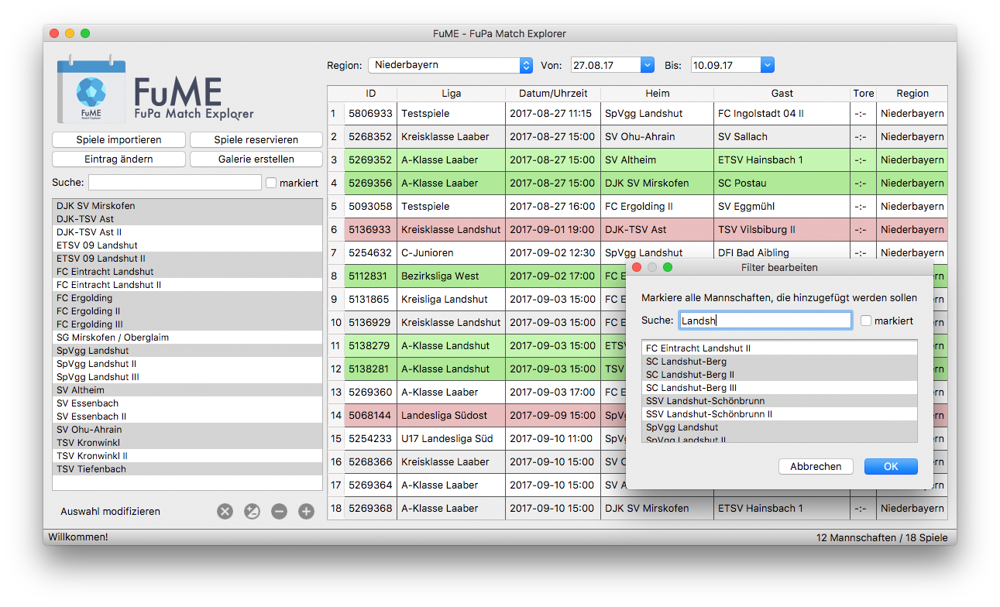
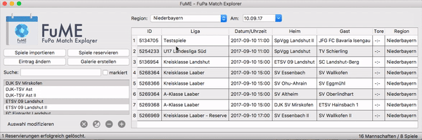
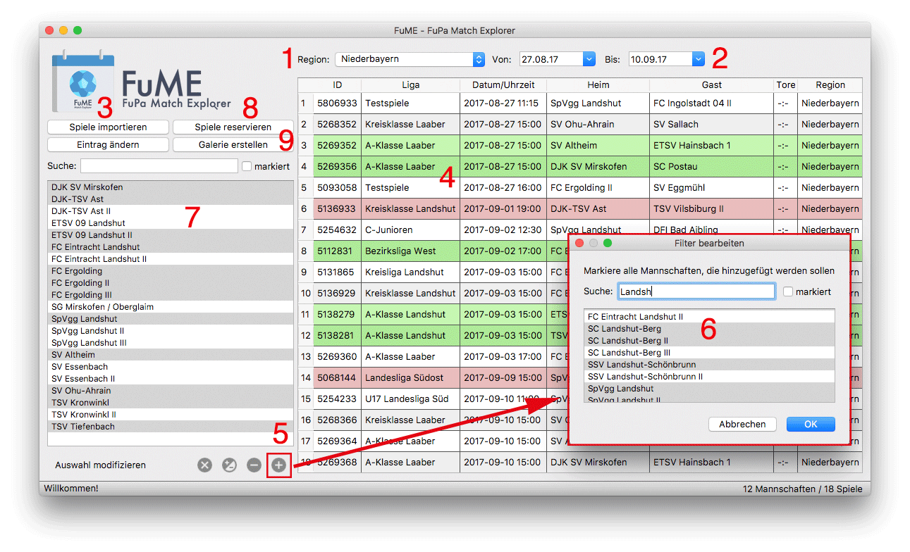

<!--- [](https://requires.io/github/fupadev/FuME/requirements/?branch=master) -->
[](https://github.com/fupadev/FuME/releases)
[](https://github.com/fupadev/FuME/releases/latest)


_Short description in english:_ FuME is the one and only Match Explorer for the German amateur soccer platform [FuPa.net](https://www.fupa.net/index.php?page=kalender)
written in python and PyQt5 and published under [GNU GPLv3](http://www.gnu.org/licenses/) license using requests for public website information
and selenium for [Vereinsverwaltung][Vereinsverwaltung] (password required).

FuME helps photographers speeding up their workflow by **filtering** all on [FuPa Match-Kalender](https://fupa.net/index.php?page=kalender) listed games by team name, match date and location - all adjustable at once! In FuPa you have to reserve every game you want to photograph (time consuming and annoying) - FuME comes with **bulk mode**  to simplify reservation process.

[](bin/screenshot.png)

FuME hilft dir beim **Planen**, **Sortieren** und **Reservieren** von Fußballspielen für das Fußballportal [FuPa.net][FuPa],
damit dir kein Spiel mehr entgeht! Region und Datum wählen, Vereine auswählen, Spiele importieren und loslegen. Pro Spieltag beschäftigst du
dich **maximal 5 Minuten** mit suchen und reservieren von duzenden Spielen und behältst somit 20+ Vereine in deiner Region im Blick.

Solltest du an der Grenze zweier Regionen wohnen (z.B. Niederbayern/Oberbayern), kümmert sich FuME um alles.
Unübersichtliche und nach Verein beschränkte Listen in der [Vereinsverwaltung][Vereinsverwaltung] gehören der Vergangenheit an.

Nach dem fotografieren, benötigt FuME nur deine Fotos und du erstellst mit einem Klick eine Galerie auf FuPa.
Alles ohne [Vereinsverwaltung][Vereinsverwaltung] und lange Listen!

## Wer braucht FuME?
Bist du **Fotograf** für [FuPa.net][FuPa] und besuchst **mehrere Spiele und Vereine pro Spieltag**? Dann ist FuME genau das richtige für dich!

## Wer kann FuME nutzen?
Jeder. Das Projekt ist Open Source, unter [GNU GPLv3](http://www.gnu.org/licenses/) veröffentlicht und steht jedem frei auf GitHub zur Verfügung. FuPa selbst unterstützt dieses Projekt.

## Features
- **filtere** nach Mannschaften, Spieltage und FuPa-Regionen
- reserviere **mehrere Begegnungen innerhalb weniger Sekunden** (siehe [gif](#noch-nicht-überzeugt))
- erstelle **Galerien mit nur einem klick**
- **multiregionaler** Support
- reserviere **vor allen anderen** (keine 14 Tage Begrenzung, siehe [unten](#faq--troubleshooting))
- _und vieles mehr!_

## Noch nicht überzeugt?
Wie schnell reservierst du sechs Spiele von vier Mannschaften? Mit FuME schaffst du es in 5,5 Sekunden, also **ein Spiel pro Sekunde**:

<div style="text-align:center"></div>

## Download

### Voraussetzungen
Für die meisten Funktionen der [Vereinsverwaltung][Vereinsverwaltung] (z.B. reservieren/Galerien erstellen) wird [Google Chrome][Chrome] (Version 60 oder neuer) benötigt.
Du kannst den Browser **auch später** installieren und nur die Filter nutzen (Spiele importieren und nach Datum/Vereine filtern)

### Windows
- [FuME.exe für Windows von hier downloaden][download_url_windows]
- Installer öffnen und den Anweisungen folgen (Sicherheitswarnung bestätigen)
- FuME aus dem Startmenü öffnen oder Desktop-Verknüpfung benutzen (falls erstellt).
- Weiter mit [erste Schritte](#erste-schritte--schnellanleitung)

_Windows 7 oder höher wird empfohlen. Ältere Versionen werden nicht zwingend unterstützt._

### macOS
- [FuME.dmg für macOS von hier downloaden][download_url_macOS]
- FuME.dmg öffnen und das "FuME-Icon" auf "Programme" ziehen.
- Im Finder eigene Programme öffnen und die FuME.app mit **Rechtsklick -> Öffnen** starten.
- Warnmeldung "FuME ist ein aus dem Internet geladenes Programm" bestätigen
- Weiter mit [erste Schritte](#erste-schritte--schnellanleitung)

_macOS Version 10.12 (Sierra) oder höher wird empfohlen. Ältere Versionen werden nicht zwingend unterstüzt._

## Erste Schritte / Schnellanleitung
[](bin/anleitung.png)

Beginne mit der Auswahl deiner Region im Dropdown-Menü _(1)_. Beschränke dann den Zeitraum (von/bis), für den die Spiele **angezeigt**
und **importiert** werden sollen _(2)_. Zum Beispiel heute. Aktuelle Spiele in FuPa importierst du mit dem Knopf "Spiele importieren" _(3)_. Diese erscheinen dann in der Übersicht _(4)_.

Jetzt kannst du noch nach **Vereine** bzw. **Mannschaften** filtern. Dafür klicke das "+" _(5)_. Es öffnet sich das Fenster "Filter bearbeiten" _(6)_.
Dort markierst du Mannschaften, die du zur Liste _(7)_ hinzufügen möchtest. Du kannst mehrere Mannschaften markieren, indem du die Maus gedrückt hältst und nach unten bewegst.
Nach einem Klick auf "OK" erscheinen die ausgewählten Einträge in deiner Mannschaftsliste _(7)_. Markiere dort ein paar Mannschaften.

Super! Du hast jetzt Spiele nach Mannschaft _(7)_, Datum _(2)_ und Region _(1)_ gefiltert.
Sollte bei dir die Übersicht _(4)_ leer sein, so haben keine deiner Mannschaften ein Heimspiel (im ausgewählten "Filter"). Ändere dann einfach die Filtereinstellungen.

Für alle Funktionen, die du auch über die [Vereinsverwaltung][Vereinsverwaltung] erreichen kannst - z.B.
Spiele reservieren _(8)_ oder Galerien hochladen _(9)_ - wird der Browser [Google Chrome][Chrome] und ein Cookie benötigt.
Der Cookie dient FuME dazu, dass du dich nicht jedes Mal neu in FuPa einloggen musst, um alle Funktionen nutzen zu können. Diesen Schritt musst du auch **nur ein Mal** durchführen.
FuME speichert dafür _keine_ Passwörter oder sonstige sensiblen Daten!

Falls du Chrome bereits installiert und mindestens ein Mal gestartet hast, öffne FuMEs Einstellungen

* über Datei -> Einstellungen in Windows oder
* über FuME -> Einstellungen in macOS, bzw. ⌘,

Dort hast du jetzt die Möglichkeit einen Cookie (wie oben beschrieben) zu erstellen. Gib deine Emailadresse und dein
Passwort für die [Vereinsverwaltung][Vereinsverwaltung] in die beiden Felder ein und klicke **Cookie erzeugen**.

Viele Funktionen _verstecken_ sich in der Menüleiste unter "Bearbeiten" und "Ansicht", wie zum Beispiel **Reservierungen löschen** oder **Spielberichte anzeigen**.

## FAQ / Troubleshooting
https://fupadev.github.io/FuME/#faq--troubleshooting

## Bugs / Kontakt
FuME ist Open Source und wurde von [Andreas Feldl](https://github.com/ndrsfldl) erstellt. Fehler, Bugs oder Wünsche bitte unter [Issues](https://github.com/fupadev/FuME/issues) melden.
Bei Fragen oder Probleme gerne eine Email an <a href="mailto:fume@afeldl.de?subject=FuME">fume@afeldl.de</a>

## Mithelfen / Contribute
Starte FuME über den Terminal
```bash
git clone https://github.com/fupadev/FuME.git
cd fume
python3 install -r requirements.txt
python3 main.py
```
Nimm Änderungen an den Dateien vor, z.B. am Main-Script ``/fume/main.app``.

## Lizenz / Credit
Dieses Projekt verwendet die [GNU GPLv3](http://www.gnu.org/licenses/) Lizenz gemäß PyQt, siehe [Riverbank Computing](https://www.riverbankcomputing.com/commercial/pyqt)

Basic Logo made by [Freepik](http://www.freepik.com/) from [www.flaticon.com](http://www.flaticon.com)
and Command Link Button Icons by <a href="http://www.flaticon.com/authors/google" title="Google">Google</a> from <a href="http://www.flaticon.com" title="Flaticon">www.flaticon.com</a> is licensed by <a href="http://creativecommons.org/licenses/by/3.0/" title="Creative Commons BY 3.0" target="_blank">CC 3.0 BY</a>

[download_url_windows]: https://github.com/fupadev/FuME/releases
[download_url_macOS]: https://github.com/fupadev/FuME/releases
[Chrome]: https://www.google.com/chrome/browser/desktop/index.html
[Vereinsverwaltung]: https://www.fupa.net/fupa/admin/index.php
[FuPa]: https://www.fupa.net/